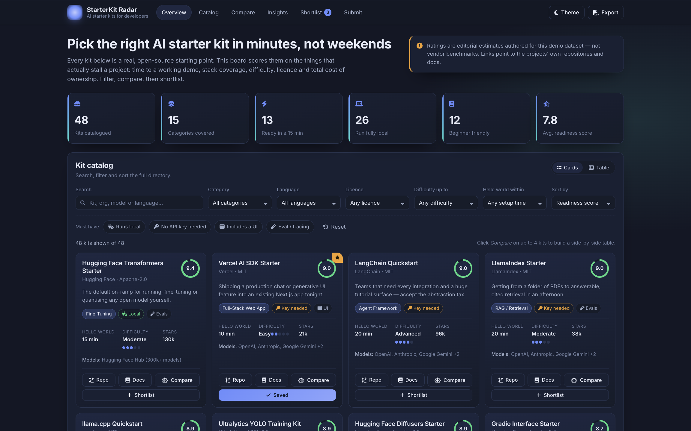

# StarterKit Radar — AI Starter Kit Dashboard for Developers

A static, frontend-only dashboard that helps developers choose between AI starter kits,
templates and reference applications. Instead of a flat link list, every kit is scored on
the things that actually stall a project: **time to a working hello world, stack coverage,
difficulty, maturity, documentation quality, licence and total cost of ownership**.

Filter and sort the catalog, build a side-by-side comparison of up to four kits, and keep
a persistent shortlist.



---

## 1. Currently completed features

### Overview board

- Six live summary statistics computed from the catalog: total kits, categories covered,
  kits ready in ≤ 15 minutes, kits that run fully local, beginner-friendly kits, and the
  average readiness score.

### Catalog (52 kits, 15 categories)

- **Search** across kit name, maintainer, category, "best for" text, pricing, licence,
  languages and supported model providers.
- **Filters**: category, language, licence, maximum difficulty, and maximum time to hello world.
- **Requirement toggles**: runs fully local · no API key needed · includes a UI · eval/tracing hooks.
- **Sorting**: readiness score, popularity, fastest setup, easiest first, maturity,
  cost friendliness, or name A–Z.
- **Two layouts**: responsive card grid (default) and a dense sortable table view.
- Each card shows a readiness score ring, category and capability badges, hello-world time,
  a 5-dot difficulty rating, GitHub star count, supported models, and links to the project's
  repo and docs.
- One-click **reset** for all filters, and a **CSV export** of exactly the rows currently visible.

### Comparison

- Select 2–4 kits for a 20-attribute side-by-side table covering scoring dimensions, licence,
  languages, model providers, cost model, stars, and capability flags.
- Rows that genuinely discriminate are marked with a ★ against the winning value;
  non-discriminating rows are left unflagged.

### Insights (ECharts)

- Four switchable charts: **kits per category**, **setup-speed distribution**,
  **setup-effort vs. readiness bubble chart**, and **licence mix**.
- A fixed "Top 8 by readiness score" bar chart.
- The category chart reflects the _current_ filter selection, so it doubles as a live breakdown.
- Charts re-theme and re-render when the colour theme changes.

### Shortlist (persistent)

- Save any kit to a shortlist stored through the RESTful Table API.
- Rows are ranked, show the kit, the maintainer, an auto-generated note and the date added.
- Remove individual entries; the nav badge and kit cards stay in sync.
- If the table is empty on first load, three seeded example entries are created.

### Automated catalog refresh

- `data/kits.json` is the source of truth; `js/kits-data.js` is generated from it.
- A weekly GitHub Action (`.github/workflows/refresh-kits.yml`, also runnable via
  **Run workflow**) refreshes `stars`, `license`, `activityScore` and `popularity` from the
  GitHub API, commits the result, and GitHub Pages redeploys.
- **Dead kits are pruned**: a repo that returns 404/410 is removed from the catalog;
  archived repos stay but are flagged `needsReview` and their activity score drops.
- **Adding a kit is a two-line edit**: put `{ "name": "…", "repo": "https://github.com/…" }`
  in `data/kits.json` and the script fills org, description, docs, languages, licence,
  category and provisional ratings, flagging the entry `needsReview` until a human checks
  the editorial fields.
- **Discovery**: the same script searches GitHub for new starter-kit repos and appends
  unseen ones to `data/candidates.json` — a review queue, not auto-published, since ratings
  are judgement calls. Promote a candidate by copying it into `data/kits.json`; block one
  forever by adding its slug to `data/ignored.json`.
- Editorial fields (difficulty, hello-world time, maturity, `bestFor`, …) are never
  overwritten once set.
- Refresh locally with `node .github/scripts/update-kits.mjs` (optionally with
  `GITHUB_TOKEN` set for a higher rate limit).

### Platform / UX

- Dark-first design with a light theme toggle; the theme is remembered and defaults to the
  visitor's system preference.
- Accessible markup: landmark elements, a skip link, labelled controls, `aria-pressed`
  toggles, `sr-only` captions, visible focus rings, and `prefers-reduced-motion` support.
- Responsive at desktop, tablet, phone and small-phone widths (1440 / 1180 / 900 / 640 / 380 px).
- Toast notifications for every storage action, plus a scroll-spy nav.
- **Resilience**: all storage reads/writes are wrapped, and if the Table API is unreachable the
  app falls back to `localStorage` (then in-memory) for the session — reads fail silently and a
  one-time toast appears only when the user first saves or removes a shortlist entry.

---

## 2. Functional entry URIs

This is a **single-page static site** — there is no server-side routing and no build step.

| Path                           | Description                                                   |
| ------------------------------ | ------------------------------------------------------------- |
| `index.html`                   | The entire dashboard (all sections are anchors on this page). |
| `index.html#overview-section`  | Hero + summary statistics.                                    |
| `index.html#catalog-section`   | Filterable / sortable kit catalog.                            |
| `index.html#compare-section`   | Side-by-side comparison table.                                |
| `index.html#insights-section`  | ECharts insights.                                             |
| `index.html#shortlist-section` | Persistent shortlist.                                         |
| `css/style.css`                | Design system (tokens, components, dark + light themes).      |
| `css/responsive.css`           | All media queries.                                            |
| `data/kits.json`               | The catalog dataset (source of truth — edit here).            |
| `js/kits-data.js`              | Generated `KITS` array — do not edit by hand.                 |
| `js/kits-meta.js`              | Derived helpers (categories, languages, licences, scoring).   |
| `js/app.js`                    | All dashboard logic (filters, compare, charts, CRUD, theme).  |

### Data API used by the page (relative URLs, provided by the project runtime)

| Method   | Endpoint                     | Used for                    |
| -------- | ---------------------------- | --------------------------- |
| `GET`    | `tables/shortlist?limit=200` | Load the shortlist.         |
| `POST`   | `tables/shortlist`           | Add a kit to the shortlist. |
| `DELETE` | `tables/shortlist/{id}`      | Remove a shortlist entry.   |

### In-page controls (no URL parameters)

Filter state is held in memory only; it is **not** written to the query string, so filter
combinations are not shareable links yet (see §4). The only persisted state is the theme
(`localStorage` key `skr:theme`) and the `shortlist` API table below. CSV export can be
triggered from the header for the current result set.

---

## 3. Data models, structures and storage

### Seed catalog — `data/kits.json` → `js/kits-data.js`

The catalog lives in `data/kits.json` (52 objects); `js/kits-data.js` wraps it as a `KITS`
array so no network call is needed to render. `js/kits-data.js` is generated — run
`node .github/scripts/update-kits.mjs` after editing the JSON (the weekly workflow does
this automatically, including refreshing live GitHub metrics).

```js
{
  id, name, org, category,
  languages: [], models: [],
  license,
  difficulty,          // 1–5 (Beginner → Expert)
  timeToHelloWorld,    // minutes
  maturity, ecosystem, costFriendliness, docsQuality, activityScore, popularity, // 0–10
  hasUI, hasBackend, hasEvals, requiresKey, localFirst,  // booleans
  stars, pricing, bestFor,
  repo, docs,          // external http(s) links
  score                // derived: weighted 0–10 readiness score
}
```

`computeKitScore()` derives the readiness score from maturity (22%), popularity (18%),
ecosystem (16%), docs quality (16%), maintenance activity (16%) and cost friendliness (12%).
`CATEGORIES`, `LANGUAGES` and `LICENSES` are derived from the dataset, so the filter
dropdowns never drift from the data.

> **Note on provenance:** the linked repositories are real, well-known open-source projects.
> The numeric ratings and `bestFor` text are **editorial estimates authored for this demo
> dataset** — they are comparative judgements, not vendor benchmarks or published metrics.
> Replace them with your own figures in `data/kits.json`.

### Persistent tables (RESTful Table API)

**`shortlist`**

| Field      | Type     | Notes                                   |
| ---------- | -------- | --------------------------------------- |
| `id`       | text     | System record id.                       |
| `kit_id`   | text     | Catalog slug, e.g. `ollama-playground`. |
| `kit_name` | text     | Display name captured at save time.     |
| `note`     | text     | Why it was shortlisted.                 |
| `added_at` | datetime | When it was shortlisted.                |

Plus system fields `gs_project_id`, `gs_table_name`, `created_at`, `updated_at`.

### Security note

All rendering of stored data goes through an `esc()` HTML-escaper, and every
link is routed through `safeUrl()`, which permits only `http:`/`https:` before the value
reaches an `href` attribute (blocking `javascript:` URLs). Note that the shortlist's add
and delete actions are **public and unauthenticated** — anyone can add or remove entries.
A static site cannot enforce real per-user permissions; use the Hosted access rules if the
whole page needs to be restricted.

---

## 4. Features not yet implemented

- **Shareable filter state** — filters live in memory only, not in the URL query string.
- **Server-side search / pagination** — all 52 kits are filtered client-side; the API's
  `search`, `sort`, `page` and `limit` parameters are unused.
- **Admin curation** — no way to edit catalog entries or ratings from the UI; editorial
  fields are updated by editing `data/kits.json` and pushing.
- **Authentication and per-user shortlists** — one shared shortlist for all visitors.
- **Side-by-side charts** and saved comparison permalinks.
- **Kit detail pages** — everything lives on the single page; there are no routes per kit.

---

## 5. Recommended next steps

1. **Sync filters to the URL** (`?cat=…&lang=…&sort=…`) so a filtered view can be shared and
   the back button works.
2. **Move search server-side** via `GET tables/kits?search=…&sort=…&page=…` if the catalog
   grows past a few hundred entries.
3. **Add a kit detail view** (or a modal) with deeper notes, quickstart snippets and a
   first-run checklist, but there are no routes to pollute.
4. **Show data freshness** — record a `checked_at` date in `data/kits.json` (the refresh
   workflow already updates it weekly) and surface it in the footer so staleness is visible.
5. **Restrict writes** if the shortlist add/delete actions should not be public — see the
   Hosted access rules, and remember a client-side check is never real security.
6. **Wire up the unused comparison/integration fields** (e.g. `hasBackend`) into the filters
   so the requirement toggles cover every capability flag.

---

## 6. Project details

- **Project name:** StarterKit Radar
- **Type:** Static single-page dashboard (HTML + CSS + vanilla JS, no build step, no backend)
- **Goal:** Make the "which AI starter kit should I clone?" decision fast, evidence-based and
  comparable, rather than a list of links.
- **Frontend libraries:** ECharts 5.4.3 (via jsDelivr, for insights), Font Awesome 6.4.0
  (icons), Inter (Google Fonts).
- **Storage services:** RESTful Table API — `shortlist` table (with a `localStorage`
  fallback if the API is unavailable).
- **Catalog refresh:** weekly GitHub Action calls the GitHub API and commits updated
  `stars` / `license` / `activityScore` / `popularity` values (see §1).
- **Public URLs:** After publishing, the live site URL is issued by the platform
  (Publish tab → Hosted Deploy). No public API endpoints are consumed; all external links
  are to the listed projects' own repositories and documentation.

### File layout

```
index.html                      # dashboard markup (all sections)
css/style.css                   # design tokens + component styles
css/responsive.css              # media queries (1180 / 900 / 640 / 380 px)
data/kits.json                  # 52-kit catalog — source of truth
data/candidates.json            # auto-discovered kit suggestions (review queue)
data/ignored.json               # repos permanently excluded from discovery
js/kits-data.js                 # generated KITS array (from data/kits.json)
js/kits-meta.js                 # score helpers + derived filter lists
js/app.js                       # filters, compare, charts, shortlist CRUD, theme
.github/scripts/update-kits.mjs # GitHub API refresh + kits-data.js regeneration
.github/workflows/refresh-kits.yml # weekly scheduled refresh
README.md                       # this file
```

No affiliation with the projects listed. Kit names and marks belong to their respective owners.

---

## 7. About

StarterKit Radar is built by **DevArts Lab**, a Boston-based technology lab founded by
**Amir Olyaei**. DevArts Lab designs practical tools, dashboards and automation for
nonprofits and community organizations — with a focus on revenue technology, data
workflows and accessible, no-build-step web apps.

This project is part of the lab's exploration of how to make AI tooling decisions more
structured and evidence-based. Feedback, kit suggestions and contributions are welcome —
open an issue.

- **Website:** [devartslab.com](https://devartslab.com)
- **Github** [devartslab](https://github.com/DevArtsLab)
